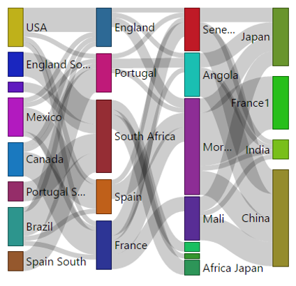

# powerbi-visuals-gantt

> A Gantt chart is a type of bar chart which illustrates a project timeline or schedule. The Gantt Chart visual shows the Tasks, Start Dates, Durations, % Complete, and Resources for a project. The Gantt Chart visual can be used to show current schedule status using percent-complete shadings and a vertical "TODAY" line. The Legend may be used to group or filter tasks based upon data values.

# Overview

Gantt chart is a type of bar chart to illustrate a schedule with time axis. When you put Gantt chart along with other insightful charts in an interactive canvas, you can manage your project in whole new way. In Power BI as visuals interact with each other, you can look at your resource allocation, task completion, remaining tasks in different perspective and get a firm handle on the future.
Gantt charts are indispensable part of project management portfolio. Project Managers and executives love Gantt charts, since they visually show in a very effective at-a-glance way, the overall time line of the project, the current status & progress (or lack thereof) along with the assignment at considerable details.
With this custom visual, you can specify the Tasks, Start Date, Duration and %Completion for rendering them as Gantt. Please note that the %Completion expects a decimal value ( for example 0.85 means 85%) and Start Date , a date field and not a date hierarchy.
You can also control the color of the bar with a Legend. You can use any relevant field from your project as Legend for example task type for this purpose. Additionally, you can also specify the resource field, which would be listed next the bar in the Gantt.

See also [Gantt chart at Microsoft Office store](https://store.office.com/en-us/app.aspx?assetid=WA104380765&sourcecorrid=968c5e90-8711-48fe-b9b4-a15ad9fe8dc4&searchapppos=0&ui=en-US&rs=en-US&ad=US&appredirect=false)
